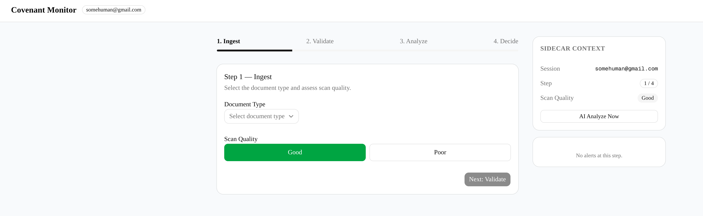
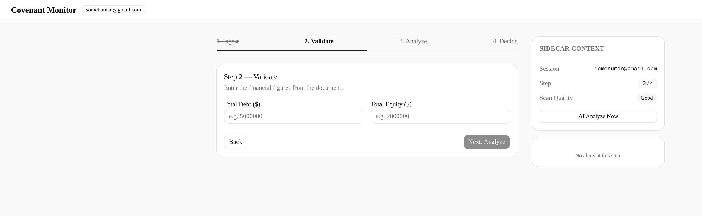
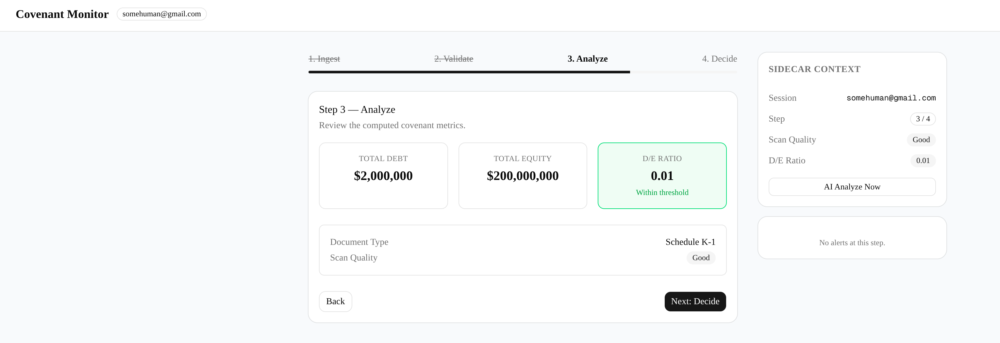
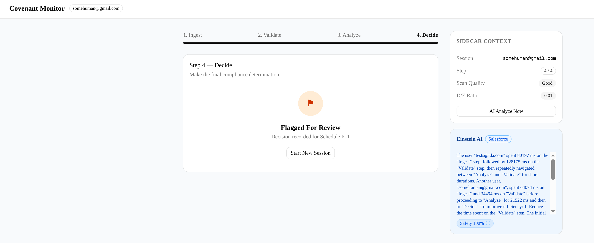
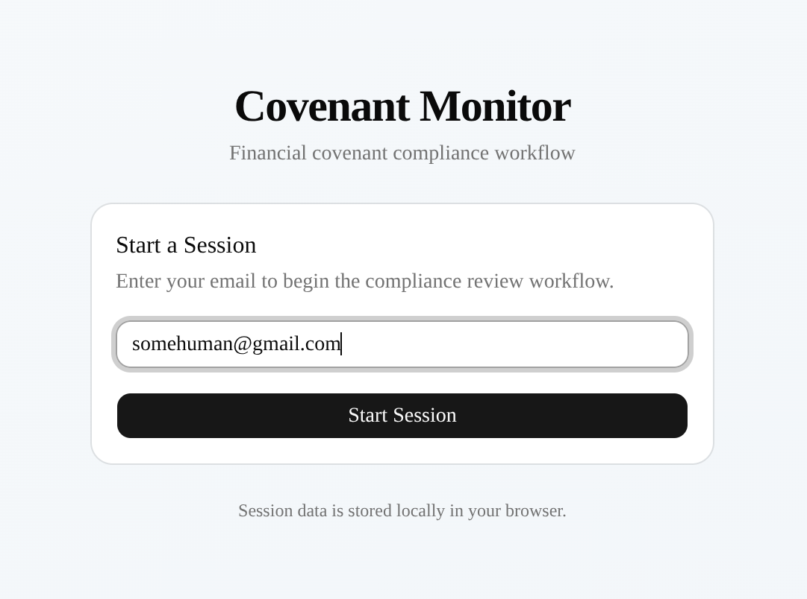
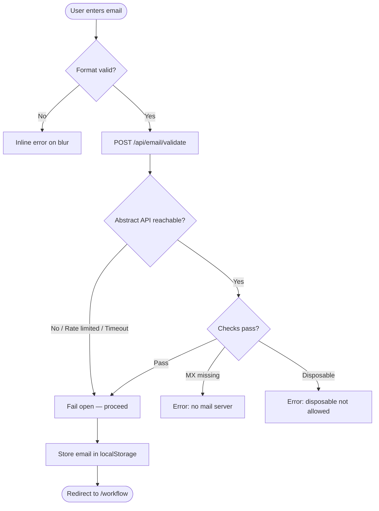

# Covenant Monitor

Financial covenant compliance workflow - POC

**Live:** `https://covenant-eight.vercel.app`

**Repo:** [https://github.com/RadifMasud/Covenant](https://github.com/RadifMasud/Covenant)

---

## Running Locally

```bash
npm install
npm run dev
```

| Route | Purpose |
|---|---|
| `/` | Email gate |
| `/workflow` | 4-step compliance wizard |
| `/admin` | COO operations dashboard |

---

## UI

### Email Gate `/`

Two-layer validated entry point. Format check fires on blur; deep validation (MX + disposable detection) fires on submit via Abstract API. Fails open if the API is unreachable.


---

### Workflow `/workflow`

A 4-step compliance wizard with a persistent Sidecar panel. The Sidecar shows live context, rule-based nudges, and an on-demand AI analysis button at every step.

**Step 1 — Ingest**: Select document type and scan quality.



**Step 2 — Validate**: Enter Total Debt and Total Equity. D/E ratio previews inline.



**Step 3 — Analyze**: Computed D/E ratio with threshold coloring. Sidecar shows High Risk nudge if ratio > 2.5.



**Step 4 — Decide**: Approve, Flag, or Reject. Decision is recorded to telemetry with full upstream context.



---

### Admin Dashboard `/admin`

COO-facing view over 1,000 seeded sessions. Demonstrates that Poor scan quality drives a ~40% higher flag rate and 1.5–2x longer time-to-decision — the business case for an automated OCR pre-processor.



> Add screenshots to `public/screenshots/` and commit. File names must match the paths above.

---

## AI Integration — Salesforce Einstein LLM Gateway

The **"AI Analyze Now"** button in the Sidecar calls a Salesforce Einstein Prompt Builder template via the Einstein LLM Gateway. Available at every step. Auto-clears after 10 seconds or on step navigation.

### Architecture

```
Browser (Sidecar)
    │
    │  POST /api/sfdc/analyze
    │  { eventdata: JSON string }
    ▼
Next.js API Route (server-only)
    │
    ├─ 1. OAuth client_credentials → SFDC token endpoint
    │      Token cached 55 min (module-level)
    │
    └─ 2. POST /services/data/v60.0/einstein/prompt-templates/
               Covenant_Event_Summarizer/generations
               Authorization: Bearer <token>
    │
    ▼
Response: generations[0].text + safetyScoreRepresentation
    │
    ▼
Sidecar renders summary card + safety score pill (hover for full scores)
```

### Payload

The `Input:eventdata` field sent to the prompt template is a JSON string containing the full session telemetry merged with the current workflow state:

```json
{
  "events": [ ...sessionStorage covenant_events ],
  "workflowState": {
    "docType": "Schedule K-1",
    "scanQuality": "Poor",
    "debtToEquityRatio": 4736.79
  }
}
```

This gives the LLM both **behavioral context** (what the analyst did, how long, where they backtracked) and **factual context** (the document data itself).

### Response

```json
{
  "generations": [{
    "text": "The user spent 167s on Ingest, changed document type multiple times...",
    "safetyScoreRepresentation": {
      "safetyScore": 0.9999,
      "toxicityScore": 0.0,
      ...
    }
  }]
}
```

The `text` field is displayed in the Sidecar. The safety score pill shows the overall score; hovering reveals all 7 sub-scores.

### Fail-Open

| Failure condition | Behavior |
|---|---|
| SFDC token request fails | 503 returned to client; Sidecar shows error card |
| 401 on prompt call | Token cache cleared, one retry, then error card |
| Prompt response unparseable | 500 returned; error card shown |
| Any other error | Error card shown; workflow unblocked |

Credentials (`SFDC_INSTANCE_URL`, `SFDC_CLIENT_ID`, `SFDC_CLIENT_SECRET`) are server-only — never exposed to the browser.

---

## Security: Email Gate

Two-layer validation before a session is issued.

**Layer 1 — Format** (client-side, on blur): regex check `/^[^\s@]+@[^\s@]+\.[^\s@]+$/`. Blocks obvious garbage instantly, no network call.

**Layer 2 — Deep validation** (server-side, on submit): proxied through `/api/email/validate` to [Abstract API](https://www.abstractapi.com/email-verification). Checks MX records and disposable email detection. The API key never leaves the server. If Abstract is unavailable or rate-limited, the gate **fails open** — the user is never blocked by an infra failure.

Once valid, the email is stored in `localStorage` (`covenant_email`) as a lightweight session token. Telemetry events in `sessionStorage` (`covenant_events`) are scoped to the tab and auto-cleared on close.



> For production: replace the email gate with SSO + a server-side session token. The current design is appropriate for an instrumented demo where the goal is friction tracking, not authentication.

---

## Telemetry Schema

Every interaction calls `trackEvent(stepName, actionType, metadata)` — logs to `console.log` and appends to `sessionStorage` (`covenant_events`).

```json
{
  "timestamp": "2026-04-29T12:00:00.000Z",
  "sessionEmail": "analyst@bankco.com",
  "stepName": "Validate",
  "actionType": "total_debt_changed",
  "metadata": { "value": "5000000" }
}
```

| Event | Why it's tracked |
|---|---|
| `email_gate / session_start` | Anchors every downstream event to an identity |
| `email_gate / validation_failed` | Measures how often bad emails are submitted; signals UX friction at the gate |
| `Ingest / doc_type_selected` | Field-level drop — tells us which document types analysts pick most / switch away from |
| `Ingest / scan_quality_changed` | Tracks quality signal at source; correlates with Flag rate in admin data |
| `{step} / step_exit` (with `dwell_ms`) | Per-step time-on-task; long dwell = friction or data lookup burden |
| `{step} / step_exit` (with `backtracked`) | Backtracking is a leading indicator of confusion or data unavailability |
| `Validate / total_debt_changed` | Field edit frequency distinguishes confident entry from uncertainty |
| `Validate / total_equity_changed` | Same — rapid re-edits are a proxy for document legibility problems |
| `Decide / decision_made` | Closes the loop; ties outcome to upstream quality and behavior signals |
| `sidecar / nudge_manual_review_clicked` | Measures whether analysts act on rule-based warnings |
| `sidecar / nudge_high_risk_clicked` | Measures escalation rate for high D/E cases |
| `sidecar / einstein_analyze_now` | Tracks AI feature adoption per step |
| `sidecar / einstein_analyze_success` | Confirms AI call completed; ties to suggested decision |
| `sidecar / einstein_analyze_error` | Monitors AI reliability; fail-open errors surfaced here |
| `workflow / session_ended` | Session duration and completion signal |

---

## Next Sprint: #1 Priority

**Build an Automated OCR Pre-Processor.**

The admin data is unambiguous. Poor scan quality affects 35% of sessions (352/1,000) and is the single largest driver of operational friction:

| Metric | Good Quality | Poor Quality | Delta |
|---|---|---|---|
| Flag rate | 20.7% | 26.7% | **+29%** |
| Avg time to decision | 211s | 311s | **+47%** |
| Avg Analyze dwell | 61s | 118s | **+93%** |

Analysts spend nearly **2× longer in the Analyze step** on poor-quality documents — not because the data is complex, but because they're reconciling a hard-to-read scan. That's recoverable time.

**What to build:** A pre-processing step before Ingest that normalizes document image quality (contrast, deskew, noise reduction) and extracts structured fields (Total Debt, Total Equity) via OCR. Flag unreadable documents before analyst time is spent on them.

**Expected outcome:** Eliminating the Poor cohort's friction delta would reduce the overall flag rate by ~2–3pp and cut average time-to-decision by ~35 seconds per session. At scale, that's material analyst capacity recovered.

---

## Tech Stack

| Layer | Technology |
|---|---|
| Framework | Next.js 16 (App Router) |
| Language | TypeScript 5 |
| Styling | Tailwind CSS v4 |
| Components | Shadcn/UI |
| Charts | Recharts |
| AI | Salesforce Einstein Prompt Builder |
| Email Validation | Abstract API |
| Deployment | Vercel |
